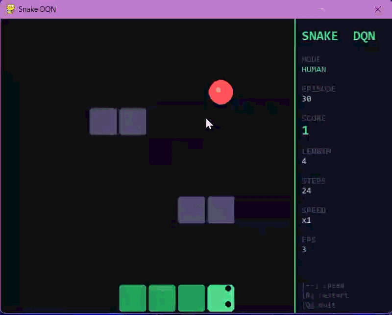
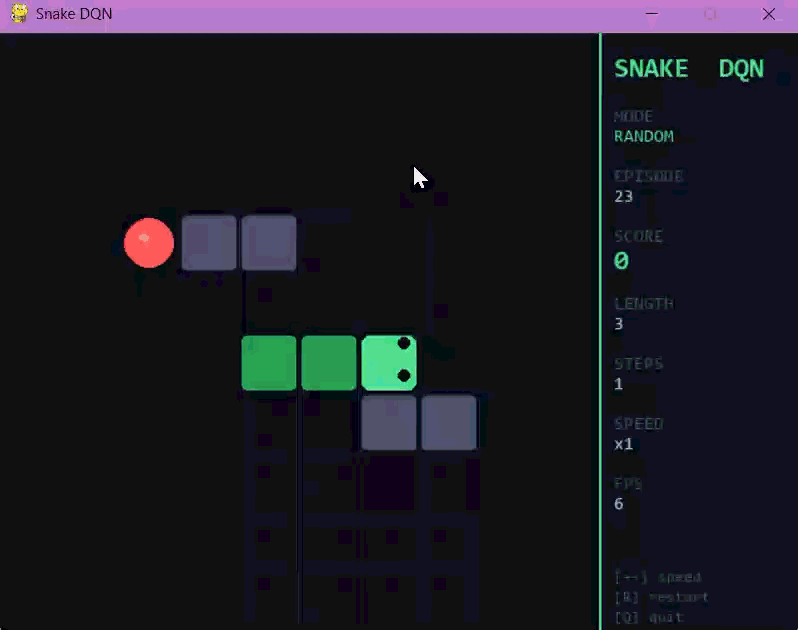
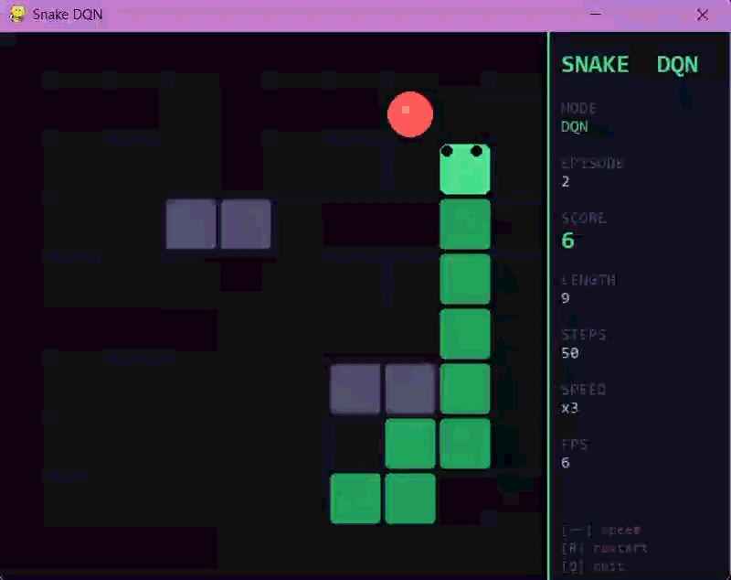
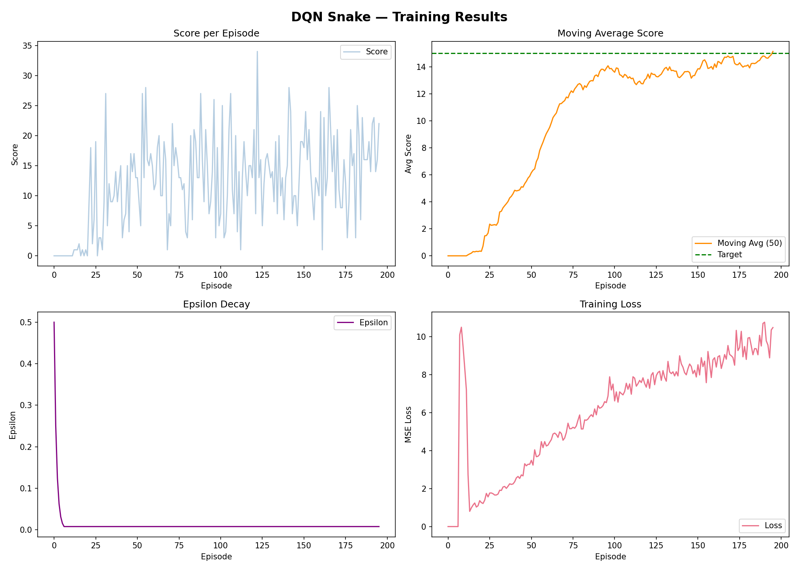
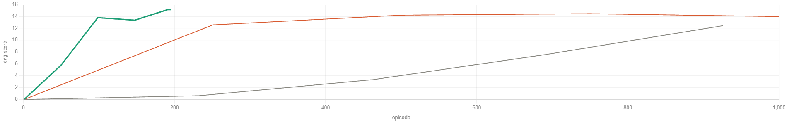
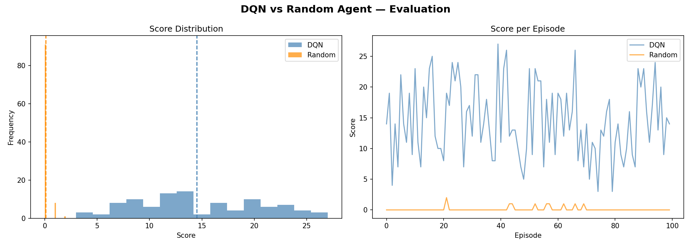

# Snake DQN — Deep Q-Learning Agent

A reinforcement learning agent that learns to play Snake from scratch using Deep Q-Networks (DQN), built with PyTorch. The agent learns purely from game experience — no hardcoded rules, no lookahead.

---

## Demo

> 🏃‍➡️ Watch human gameplay demo with arrows.



> 🎲 Watch the random agent play.



> 🎮 Watch the trained agent play after ~200 episodes of training.




---

## Results

### Training Runs — Hyperparameter Experiments

We ran three experiments to find the best hyperparameter configuration. The key insight: **lower learning rate + adjusted epsilon decay converged 5× faster** with lower loss.

| Run | Target Score | Episodes | Final Avg | Max Score | Loss (last 100) | Result |
|-----|-------------|----------|-----------|-----------|-----------------|--------|
| v1 — baseline | 15 | 926 | 15.1 | 31 | 48.9 | ✅ converged |
| v2 — tuned ✦ | 15 | 196 | 15.1 | 34 | 8.4 | ✅ **best** |
| v3 — higher target | 20 | 1000 | 14.8 | 34 | 31.9 | ❌ plateaued |

**v2 is the final model** used for all evaluation. It reaches the same performance as v1 in 196 episodes instead of 926.

### Learning Curves (v2 — best run)



### All Three Runs Compared



### DQN vs Random Agent



| Agent | Mean Score | Max Score | Std |
|-------|-----------|-----------|-----|
| Random | ~0.8 | 3 | 0.9 |
| DQN (v2) | ~15.1 | 34 | 4.2 |

---

## Architecture

```
State (11) → Linear(256) → ReLU → Linear(128) → ReLU → Linear(3)
```

The agent observes an 11-element state vector and outputs Q-values for 3 actions.

**State vector:**
```
[danger_straight, danger_left, danger_right,
 food_left, food_right, food_up, food_down,
 moving_left, moving_right, moving_up, moving_down]
```

**Actions:** `0` = straight · `1` = turn left · `2` = turn right (relative to current direction)

**Rewards:** `+10` eat food · `-10` collision · `-0.1` each step

---

## Project Structure

```
snake-dqn/
├── environment.py       # Snake grid, movement, collision, state vector
├── model.py             # QNetwork (PyTorch) — base and deep architectures
├── replay_buffer.py     # Experience replay with deque
├── agent.py             # DQNAgent — Double DQN, soft update, epsilon-greedy
├── train.py             # Training loop, checkpointing, plots, CSV logging
├── evaluate.py          # DQN vs Random Agent evaluation
├── play_pygame.py       # Visual playback (DQN / random / human mode)
├── requirements.txt
├── checkpoints/         # Saved model weights (auto-created)
│   └── best_model.pth
├── results/             # Plots and CSV logs (auto-created)
│   ├── training_curves.png
│   ├── dqn_vs_random.png
│   └── training_log.csv
└── assets/              # Images for this README
```

---

## Key Techniques

**Double DQN** — the online network selects the best next action, but the target network evaluates it. This decouples action selection from evaluation and prevents Q-value overestimation.

**Soft target update** — instead of copying weights every N steps (hard update), we blend a small fraction `τ` of the online network into the target network each step. This stabilises training.

**Experience replay** — transitions are stored in a buffer and sampled randomly for training. This breaks the temporal correlation between consecutive experiences.

**Epsilon-greedy exploration** — the agent starts by taking random actions and gradually shifts to exploiting learned Q-values as epsilon decays.

---

## Hyperparameters

| Parameter | v1 | v2 (final) | Notes |
|-----------|-----|-----------|-------|
| Learning rate | 0.001 | 0.0005 | lower lr stabilised loss |
| Epsilon decay | 0.995 | 0.997 | slower decay = better exploration |
| Tau (soft update) | 0.005 | 0.001 | more stable target network |
| Gamma | 0.99 | 0.99 | unchanged |
| Batch size | 64 | 64 | unchanged |
| Buffer size | 10000 | 10000 | unchanged |

---

## Setup & Usage

```bash
# Install dependencies
pip install -r requirements.txt

# Train the agent
python train.py

# Evaluate DQN vs Random Agent
python evaluate.py

# Watch the agent play (requires a display)
python play_pygame.py

# Other play modes
python play_pygame.py --random    # random agent
python play_pygame.py --human     # play yourself with arrow keys
python play_pygame.py --fps 15    # change speed
```

Training runs for up to 1000 episodes and saves the best checkpoint to `checkpoints/best_model.pth`. Plots and CSV logs are saved to `results/`.

---

## Team

| Member | File | Responsibility |
|--------|------|----------------|
| [DoniaGabal](https://github.com/DoniaGabal)               | `environment.py` | Grid, movement, state vector, rewards |
| [AlaaAshraf309](https://github.com/AlaaAshraf309)         | `model.py` | QNetwork architecture, save/load |
| [amira-iraqi](https://github.com/amira-iraqi)             | `replay_buffer.py` | Experience replay buffer |
| [BassamAbdelghafar](https://github.com/BassamAbdelghafar) | `agent.py` | DQN agent, Double DQN, soft update |
| [0-Ahmed-Tamer-0](https://github.com/0-Ahmed-Tamer-0)     | `train.py`, `evaluate.py`, `play_pygame.py`| Training loop, evaluation, plots, game interface |
| [AhmedQoshisha](https://github.com/AhmedQoshisha)         | Report | Report write-up, Pygame visualisation |

---

## References

- Mnih et al. (2015) — [Human-level control through deep reinforcement learning](https://www.nature.com/articles/nature14236)
- van Hasselt et al. (2016) — [Deep Reinforcement Learning with Double Q-learning](https://arxiv.org/abs/1509.06461)
- [freeCodeCamp Snake DQN Tutorial](https://youtu.be/L8ypSXwyBds) — Patrick Loeber
